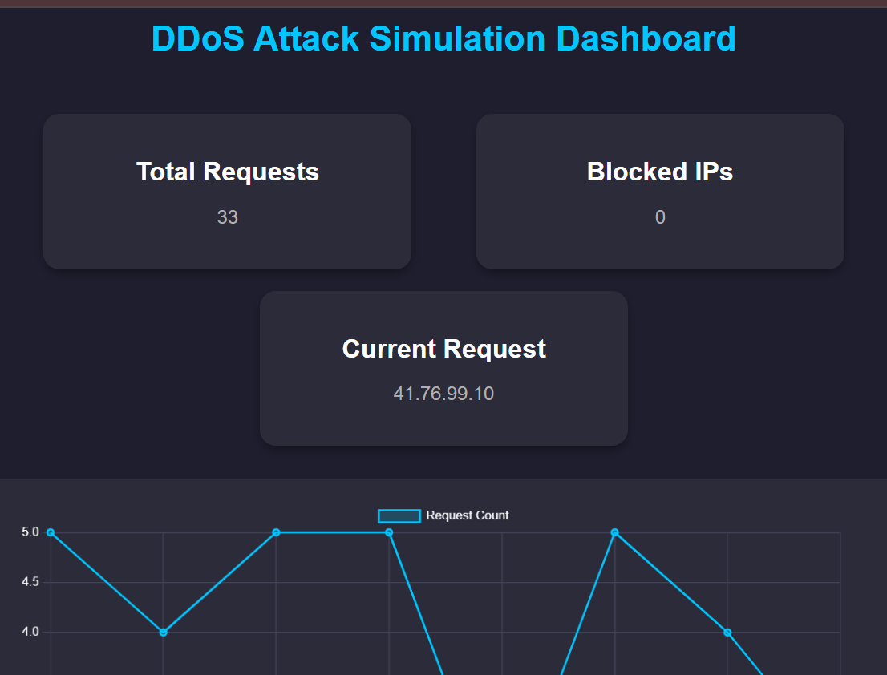
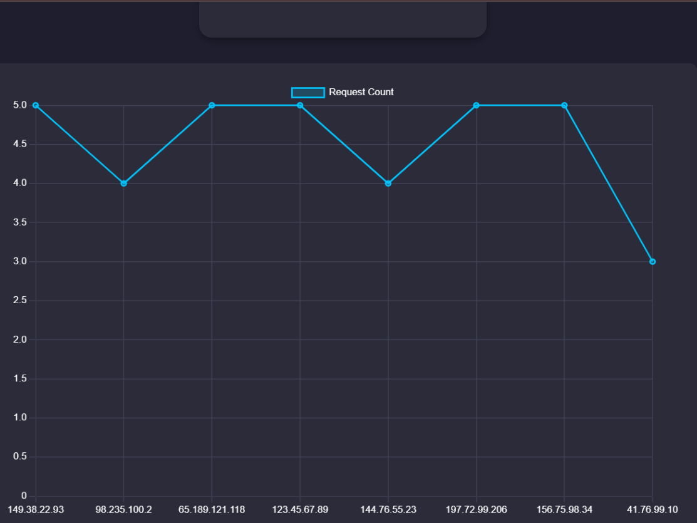

# DDoS Attack Simulation Dashboard

A web-based dashboard that simulates Distributed Denial of Service (DDoS) attacks using **Node.js**, **Express.js**, and **WebSocket**, tracking incoming requests from multiple IP addresses and visualizing the blocking of malicious IPs in real-time.

## Features
- **Real-time Request Tracking**: Displays incoming requests from various IPs.
- **IP Blocking**: Blocks IP addresses after exceeding a threshold of requests.
- **Interactive Dashboard**: Visualize the flow of requests and blocked IPs with dynamic charts.

## Technologies Used
- **Node.js**
- **Express.js**
- **WebSocket**
- **Chart.js** for data visualization

## Assets
- **Video**: A demonstration of the DDoS simulation can be found in the `assets` folder as `ddos_simulation.mp4`.
- **Screenshots**: Included are screenshots of the dashboard:
  - 
  - 

